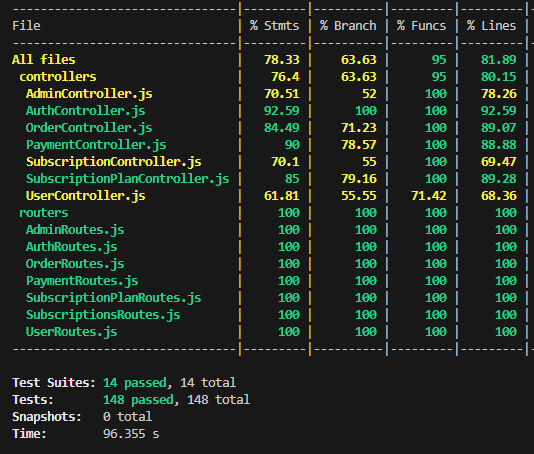

# BoxPremier Backend API

<div align="center">


API RESTful para gestionar la plataforma de suscripción de vinos BoxPremier.

</div>

---

## Tecnologías

- **Node.js** + **Express 5.1**
- **MongoDB** + **Mongoose 8.19**
- **JWT** para autenticación
- **Bcrypt** para encriptación de contraseñas
- **Jest** + **Supertest** para pruebas
- **Helmet** y **CORS** para seguridad

---

## Estructura del Proyecto
```
boxpremier-server/
├── src/
│   ├── config/
│   │   └── config.js
│   ├── controllers/
│   │   ├── AdminController.js
│   │   ├── AuthController.js
│   │   ├── OrderController.js
│   │   ├── PaymentController.js
│   │   ├── SubscriptionController.js
│   │   ├── SubscriptionPlanController.js
│   │   └── UserController.js
│   ├── database/
│   │   └── db_connection.js
│   ├── middlewares/
│   │   └── authMiddleware.js
│   ├── models/
│   │   ├── OrderModel.js
│   │   ├── PaymentModel.js
│   │   ├── SubscriptionModel.js
│   │   ├── SubscriptionPlanModel.js
│   │   └── UserModel.js
│   ├── routers/
│   │   ├── AdminRoutes.js
│   │   ├── AuthRoutes.js
│   │   ├── OrderRoutes.js
│   │   ├── PaymentRoutes.js
│   │   ├── SubscriptionPlanRoutes.js
│   │   ├── SubscriptionsRoutes.js
│   │   └── UserRoutes.js
│   ├── utils/
│   │   ├── handleJWT.js
│   │   ├── handleResponse.js
│   │   └── handleValidation.js
│   └── validators/
│       ├── AuthValidator.js
│       ├── OrderValidator.js
│       ├── SubscriptionPlanValidations.js
│       ├── SubscriptionValidations.js
│       └── UserValidator.js
├── tests/
│   ├── controllers/
│   ├── integration/
│   └── setup/
├── docs/
├── .env.example
├── .gitignore
├── app.js
└── package.json
```

---

## Instalación

### Requisitos previos

- Node.js 18+
- MongoDB 6+
- npm

### Pasos

1. Clonar el repositorio:
```bash
git clone https://github.com/BOXPREMIER/boxpremier-server.git
cd boxpremier-server
```

2. Instalar dependencias:
```bash
npm install
```

3. Configurar variables de entorno:
```bash
cp .env.example .env
cp .env.example .env.test
```

---

## Configuración

### Archivo .env
```env
HOST=localhost
PORT=
MONGO_URI=mongodb://localhost:27017/boxpremier
JWT_SECRET=tu_clave_secreta
JWT_EXPIRES=7d
NODE_ENV=development
```

### Archivo .env.test
```env
HOST=localhost
PORT=
MONGO_URI=mongodb://localhost:27017/boxpremier_test
JWT_SECRET=test_secret
JWT_EXPIRES=1h
NODE_ENV=test
```

---

## Uso

### Scripts Disponibles
```bash
npm start              # Inicia el servidor
npm run dev            # Modo desarrollo con nodemon
npm test               # Ejecuta pruebas en modo watch
npm run test:coverage  # Genera reporte de cobertura
```

---

## Modelos de Datos

### User
- **userType**: `admin` | `customer`
- **email**, **password**, **firstName**, **lastName**
- **phone**, **street**, **number**, **floor**, **postalCode**, **city**, **province**, **country** (solo customer)
- **paymentMethod**: tipo, lastFourDigits, cardHolderName, expirationDate, paymentToken
- **preferences**: emailNotifications
- **status**: activo/inactivo
- **Soft delete**: deleteAt

### SubscriptionPlan
- **boxType**: tipo de caja
- **boxSize**: número de botellas
- **price**: precio mensual
- **active**: disponible para compra
- **Soft delete**: deleteAt

### Subscription
- **user**, **subscriptionPlan**
- **wineType**: `mixed` | `rose` | `red` | `sparkling`
- **boxType**, **boxSize**
- **startDate**, **nextPayDate**, **endDate**
- **status**: `active` | `paused` | `canceled` | `expired` | `pending`
- **isGift**: boolean
- **giftFromId**, **giftMessage**, **giftDurationMonths**, **giftActivatedAt** (si es regalo)
- **payMethod**

### Order
- **userId**, **subscriptionId**
- **boxType**, **wineType**, **boxSize**
- **Dirección snapshot**: fullName, phone, street, number, floor, postalCode, city, province, country
- **status**: `pending` | `preparing` | `shipped` | `delivered` | `cancelled`
- **trackingNumber**, **carrier**
- **orderDate**, **shippedDate**, **deliveredDate**
- **totalAmount**

### Payment
- **subscriptionId**, **orderId**
- **amount**, **status**: `pending` | `completed` | `failed`
- **gateway**: `multisafepay` | `paypal` | `redsys`
- **transactionId**, **paymentDate**
- **paymentType**: `recurring` | `one-time`
- **monthsPaid**

---

## API Endpoints

### Autenticación (sin autenticación)

| Método | Ruta | Descripción |
|--------|------|-------------|
| POST | `/api/auth/register` | Registrar nuevo usuario |
| POST | `/api/auth/login` | Iniciar sesión |

### Usuarios (requiere autenticación)

| Método | Ruta | Descripción | Rol |
|--------|------|-------------|-----|
| POST | `/api/users` | Crear usuario | admin |
| GET | `/api/users` | Listar todos los usuarios | admin |
| GET | `/api/users/:id` | Obtener usuario por ID | admin, customer |
| PUT | `/api/users/:id` | Actualizar usuario | admin, customer |
| DELETE | `/api/users/:id` | Eliminar usuario | admin |
| PATCH | `/api/users/me/payment-method` | Actualizar método de pago propio | customer |
| PATCH | `/api/users/:id/payment-method` | Actualizar método de pago de usuario | admin |

### Planes de Suscripción (requiere autenticación)

| Método | Ruta | Descripción | Rol |
|--------|------|-------------|-----|
| GET | `/api/plans` | Listar planes | todos (customer solo ve el propio) |
| GET | `/api/plans/:id` | Obtener plan por ID | todos |
| POST | `/api/plans` | Crear plan | admin |
| PUT | `/api/plans/:id` | Actualizar plan | admin |
| DELETE | `/api/plans/:id` | Eliminar plan (soft delete) | admin |

### Suscripciones (requiere autenticación)

| Método | Ruta | Descripción | Rol |
|--------|------|-------------|-----|
| POST | `/api/subscriptions` | Crear suscripción | customer |
| GET | `/api/subscriptions` | Listar mis suscripciones | customer |
| GET | `/api/subscriptions/details/:id` | Obtener detalles de suscripción | todos |
| GET | `/api/subscriptions/:userId` | Listar suscripciones de usuario | admin |
| PUT | `/api/subscriptions/:id` | Actualizar suscripción | customer |
| DELETE | `/api/subscriptions/:id` | Cancelar suscripción | customer |

### Pedidos (requiere autenticación)

| Método | Ruta | Descripción | Rol |
|--------|------|-------------|-----|
| GET | `/api/orders` | Listar pedidos | todos |
| GET | `/api/orders/:id` | Obtener pedido por ID | todos |
| POST | `/api/orders` | Crear pedido | admin |
| PATCH | `/api/orders/:id/status` | Actualizar estado del pedido | admin |
| PATCH | `/api/orders/:id/address` | Actualizar dirección del pedido | admin |
| PATCH | `/api/orders/:id/tracking` | Actualizar tracking del pedido | admin |
| PATCH | `/api/orders/:id/cancel` | Cancelar pedido | admin |
| DELETE | `/api/orders/:id` | Eliminar pedido (solo dev) | admin |

### Pagos (requiere autenticación)

| Método | Ruta | Descripción | Rol |
|--------|------|-------------|-----|
| GET | `/api/payments` | Listar pagos | todos |
| GET | `/api/payments/:id` | Obtener pago por ID | todos |
| POST | `/api/payments` | Crear pago | customer |
| PATCH | `/api/payments/:id/status` | Actualizar estado del pago | admin |


### Admin
Endpoints administrativos adicionales

---

## Pruebas

### Cobertura Actual



La configuración de Jest cubre:
- Controllers
- Routers

---

## Documentación de la API

Documentación completa en Postman:

[Ver documentación](https://documenter.getpostman.com/view/46421388/2sB3WttK9M)


## Contacto

**Organización:** [BoxPremier](https://github.com/BOXPREMIER)

---